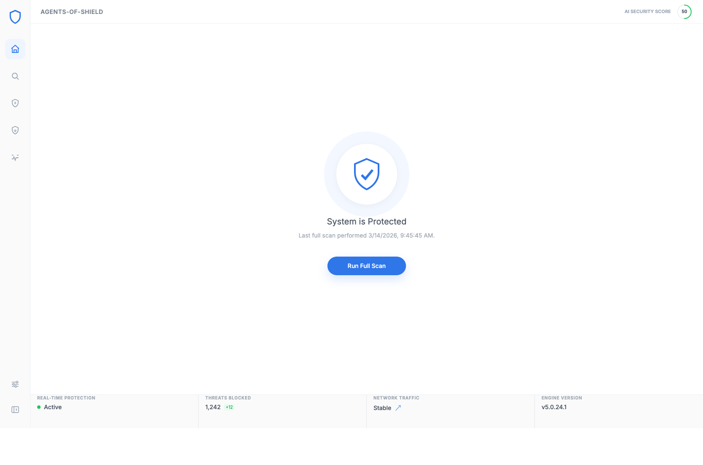
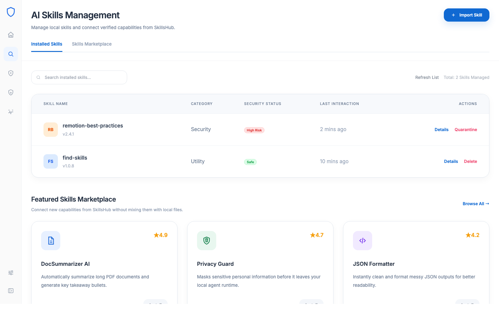
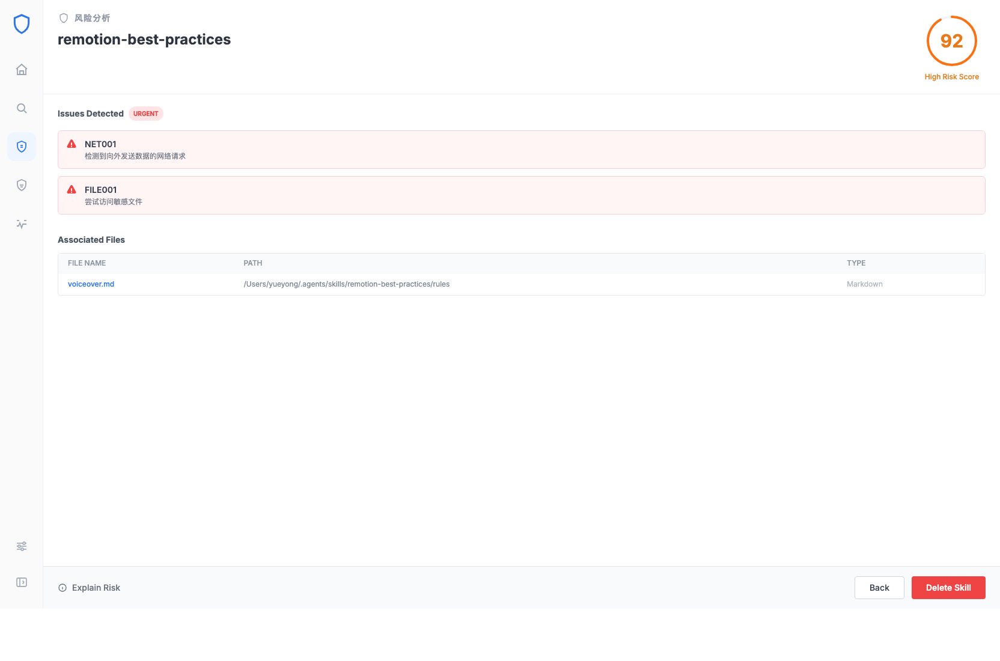
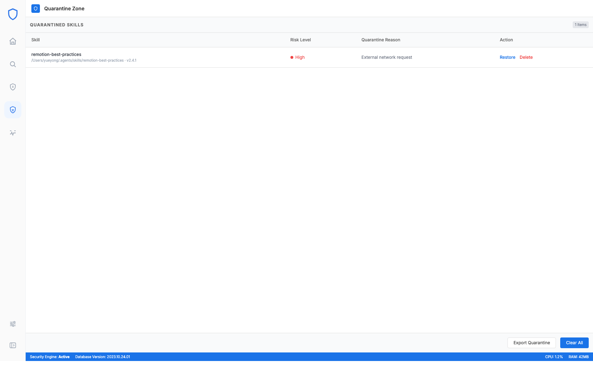
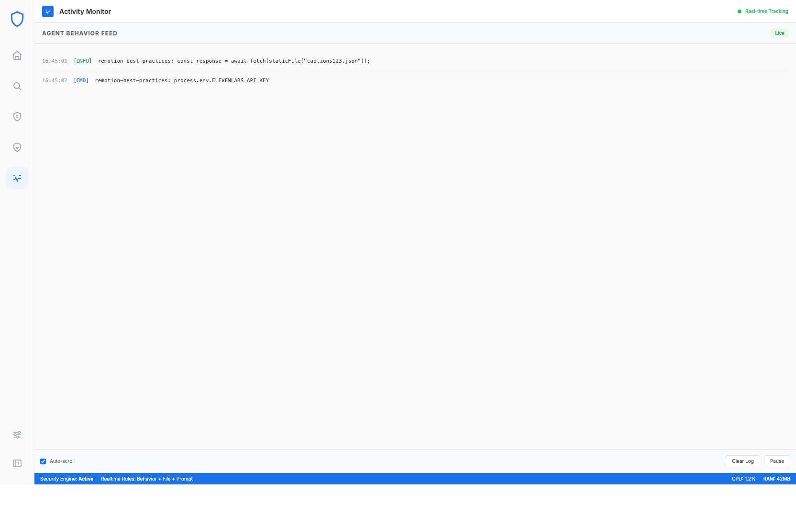

# AgentGuard (Open Source Edition)

> A lightweight, local-first security scanning tool for your AI Agent environments.

With the rapid adoption of AI Agents, Skills, and MCP Tools, ensuring the safety of your local environment has never been more critical. **AgentGuard** is a desktop application designed to scan, analyze, and manage the security posture of your local AI agent ecosystem—all without sending your data to the cloud.

## Key Features

- 🔍 **Local Asset Discovery**
  Automatically locate and index AI components (Skills, MCP Servers, Prompts, Tools) installed across standard agent directories.
- 🛡️ **Static Risk Analysis**
  Perform deep static scanning on your local files to detect high-risk patterns like unauthorized shell execution, sensitive file access, or prompt injection vulnerabilities.
- 📊 **Security Scoring**
  Evaluate the security level of each discovered component through an intuitive scoring system, helping you focus on the most critical risks.
- 🗄️ **Quarantine & Management**
  Easily review detailed risk findings, trace them back to the source code, and move dangerous components into a secure Quarantine zone.
- 📈 **Activity Monitoring**
  Keep track of agent execution paths and suspicious activities in real-time.

## UI Previews

Here is a glimpse of what AgentGuard offers:

- **Dashboard**: Get a bird's-eye view of your local environment's health.
  
- **Asset Manager**: Browse and manage your discovered local components.
  
- **Detailed Findings**: Drill down into specific code snippets that triggered security rules.
  
- **Quarantine Zone**: Isolate risky assets safely.
  
- **Activity Tracker**: Monitor runtime behaviors.
  

## How It Works

AgentGuard operates entirely on your local machine using a two-stage pipeline:

1. **Discovery Engine**: Crawls directories like `~/.openclaw/skills`, `~/.agents/skills`, and `~/.cline/plugins` to build an inventory of your AI assets (`.py`, `.js`, `.ts`, `.sh`, `.md`).
2. **Local Scanner**: Analyzes the discovered files against a set of predefined security rules to flag potential threats.

## Built With

- **Frontend**: React, TypeScript, Vite, Tailwind CSS
- **Backend**: Rust, Tauri 2.0
- **Storage**: SQLite (Local only)

## Getting Started

### Prerequisites

Ensure you have the following installed:
- [Node.js](https://nodejs.org/) (v18 or newer)
- [Rust](https://www.rust-lang.org/tools/install)
- Supported OS: macOS, Windows, or Linux

### Installation & Development

Clone the repository and install dependencies:

```bash
npm install
```

Launch the application in development mode:

```bash
npm run tauri:dev
```

### Building for Production

To build the standalone desktop application:

```bash
npm run tauri:build
```

*Note for macOS users: To distribute the app without Gatekeeper warnings, you will need to sign the `.app`/`.dmg` with an Apple Developer ID and notarize it.*

## Privacy & Data

This open-source edition of AgentGuard is strictly **local-first**.
- All scans are performed locally on your machine.
- Scan reports and settings are saved to a local SQLite database (`threats.db`) and Local Storage.
- No telemetry, analytics, or file contents are uploaded to any external servers.
